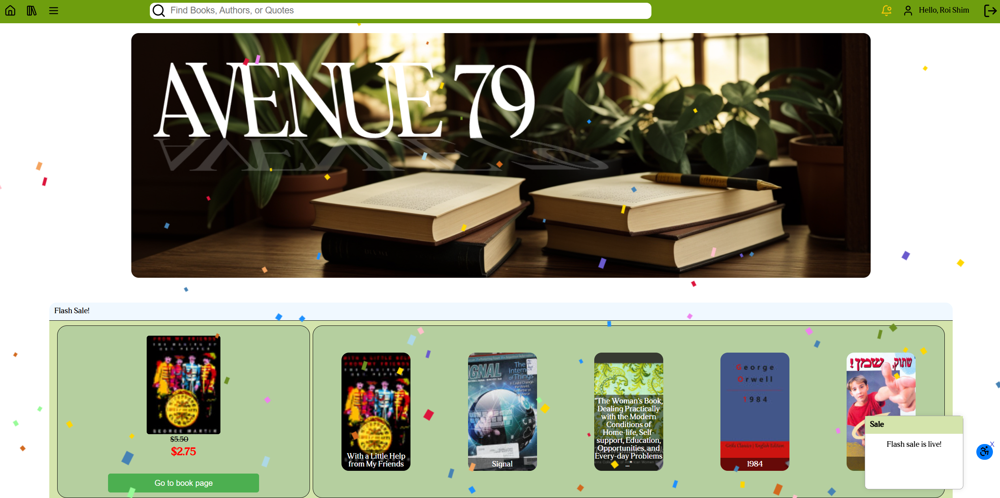
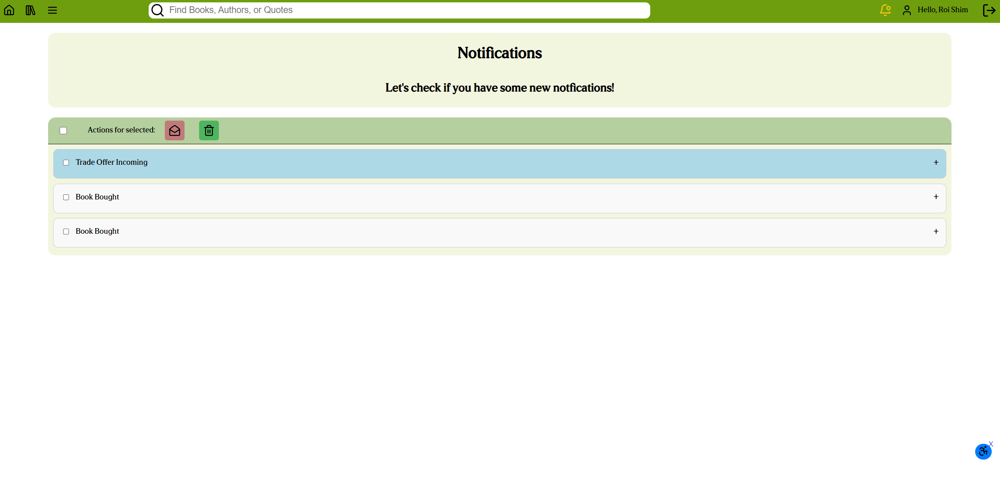
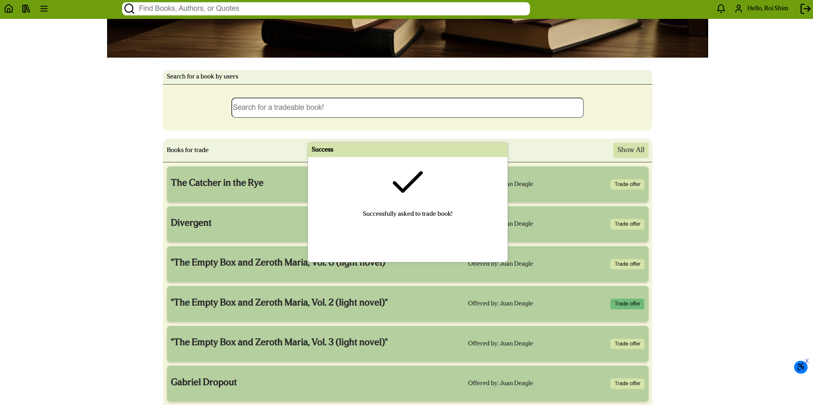

# Avenue 79 Bookstore

> A social bookstore web app — browse books, build a library, trade what you've read, and talk about authors.

*College final project — graded A+ (100)*

Developed by Roi S. , Tom K. , Dan G.

**[Live demo](https://proj.ruppin.ac.il/cgroup79/test2/tar6/main/index.html)**

---

## About

Avenue 79 is a full-stack bookstore web application. Users can create accounts, browse a catalogue of real books and ebooks, build a personal library, wishlist titles, write reviews, and trade books they've already read with other users. Each author has a dedicated page with a discussion forum and live chat. Every Thursday evening the backend triggers a short flash sale with no manual intervention required.

---

## Screenshots

| | |
|---|---|
|  |  |
| *Home page — flash sale active* | *Login / sign-up* |
|  |  |
| *Notification centre* | *Asking to trade a book* |

---

## Features

### Accounts
- Register with email and password, or sign in with Google (Firebase Authentication)
- Persistent sessions with a "remember me" option

### Library
- Browse a catalogue of books and ebooks seeded from the Google Books API
- Simulate purchasing a book to add it to your personal library
- Wishlist books you haven't bought yet
- Mark owned books as read to unlock trading

### Book Trading
Trading follows a structured six-step flow:

1. User A buys a book and marks it as read in their library
2. User A lists the book as available for trading (or giveaway)
3. User B finds the listing and sends a trade request
4. User A receives a real-time notification with accept / deny options
5. **Accept** — the book transfers from User A's library to User B's; User A loses it
6. **Deny** — User A keeps the book; User B cannot request that specific trade again

### Author Pages
- Dedicated page per author with biography pulled from Wikipedia
- Discussion forum for each author
- Live chat (real-time via SignalR — see [Known Limitations](#known-limitations))

### Reviews & Sentiment Analysis
- Rich-text reviews with a star rating system
- Submitted reviews are automatically analysed for sentiment (positive / neutral / negative) using the HuggingFace Inference API, proxied through the backend to keep the API key off the client

### Weekly Flash Sale
Every **Thursday at 7:00 PM** the backend automatically:
1. Selects 5 random books and applies a discount
2. Broadcasts a sale-start event to all connected clients via SignalR
3. After **15 minutes**, reverts all prices and broadcasts a sale-end event

No manual trigger is required — the sale is driven entirely by a .NET `IHostedService` (`WeeklyEventService`).

### Quiz & Leaderboard
- Book-themed quiz available to logged-in users
- Results tracked on a live leaderboard

### Notifications
- Real-time notification push via SignalR for trade requests, trade outcomes, and flash sale events
- Notification centre showing unread alerts with bell icon animation

### Admin Panel
- Searchable data tables for users, books, and authors
- Import new books directly from the Google Books API by ISBN or title
- All admin endpoints are server-side protected — admin status is verified per request

---

## Tech Stack

| Layer | Technology |
|---|---|
| Frontend | HTML, CSS, JavaScript (ES6 modules), jQuery, Quill.js, Splide.js |
| Backend | ASP.NET Core, C# |
| Database | Microsoft SQL Server (stored procedures) |
| Real-time | SignalR (WebSockets) |
| Authentication | Firebase Authentication (email/password + Google OAuth) |
| AI | HuggingFace Inference API — [`lxyuan/distilbert-base-multilingual-cased-sentiments-student`](https://huggingface.co/lxyuan/distilbert-base-multilingual-cased-sentiments-student) |

---

## Architecture

The frontend is a collection of static HTML pages, each importing ES6 module scripts. It communicates with an ASP.NET Core REST API that handles all business logic through a controller → BL → DAL layer, with every database call going through a stored procedure.

Firebase handles authentication on the client side — the backend does not issue its own tokens. SignalR runs as a persistent hub alongside the REST API and is used for real-time notifications, author chat, and flash sale broadcasts. The HuggingFace sentiment call is proxied through the backend so the API key is never exposed to the browser.

---

## Local Setup

### Prerequisites
- [.NET 8 SDK](https://dotnet.microsoft.com/download)
- Microsoft SQL Server
- A [Firebase project](https://console.firebase.google.com/) with Email/Password and Google sign-in enabled
- A [HuggingFace account](https://huggingface.co/) with an API token

### 1. Database
Run [`backend/schema.sql`](backend/schema.sql) against your SQL Server instance. This creates all tables, stored procedures, and seed data.

> **Note:** one stored procedure — `SP_F_IsUserAdmin` — is not included in the exported schema and must be created manually:
> ```sql
> CREATE PROCEDURE SP_F_IsUserAdmin
>     @UserID INT
> AS
> BEGIN
>     SELECT isAdmin FROM Users WHERE UserID = @UserID
> END
> ```

### 2. Firebase configuration
`frontend/script/firebaseConfig.js` is gitignored. Copy the example file and fill in your Firebase project's values (found in the Firebase console under Project Settings → General → Your apps):

```bash
cp frontend/script/firebaseConfig.example.js frontend/script/firebaseConfig.js
```

### 3. Backend configuration
`appsettings.Development.json` is gitignored. Create it at `backend/BookStore/BookStore/appsettings.Development.json` with the following structure:

```json
{
  "ConnectionStrings": {
    "DefaultConnection": "your SQL Server connection string"
  },
  "HuggingFace": {
    "ApiKey": "your HuggingFace API token"
  }
}
```

### 4. Run the backend
```bash
cd backend/BookStore/BookStore
dotnet run
```

### 5. Run the frontend
The frontend is plain HTML — open any page directly in a browser, or serve the `frontend/` folder with any static file server:
```bash
npx serve frontend
```

---

## Data Pipeline

The book catalogue was seeded using a set of Node.js scripts in the [`gettingBooks/`](gettingBooks/) folder. They fetch book and ebook metadata from the Google Books API by ISBN, enrich author entries with Wikipedia bios and images, deduplicate the results, and assign prices. See [`gettingBooks/README.md`](gettingBooks/README.md) for details.

---

## Known Limitations

- **Frontend stack** — the frontend is built with plain HTML, CSS, and JavaScript without a framework or build tool, as required by the college brief.
- **No real payments** — the "buy" flow is fully simulated. Prices are randomly assigned from a fixed list to give the feel of a store rather than a bare book API.
- **SignalR blocked on the college server** — the hosting environment blocks WebSocket connections, which means live author chat, real-time trade notifications, and live flash sale broadcasts are all non-functional on the deployed URL. The rest of the app (including the periodic notification poll) works normally.
- **No physical exchange** — the trading system transfers book ownership within the app only.
